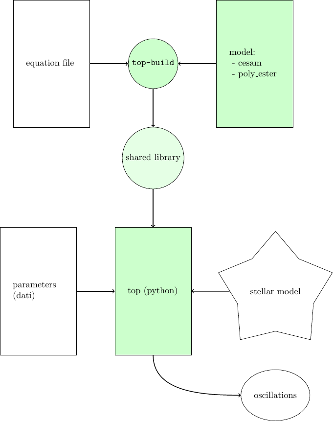

###################
TOP's documentation
###################

Overview
########

TOP consists of a python module, a compiler and several *templates* (see
:ref:`models`) to read stellar models.
This allows users to write their own set of equations in a flexible way.

The basic workflow with TOP is the following:

1. write an equation file (see :ref:`equation`)
2. compile this file with ``top-build``
3. compute oscillations modes and frequencies with ``top`` python module (see
   :ref:`api`):

   - read input parameters
   - read a stellar model
   - run the Arnoldi-Chebyshev method

    TOP's Software Architecture

Documentation
#############

.. toctree::
   :maxdepth: 2

   install
   usage
   model
   equation
   api
   examples
   download

..   hacking
